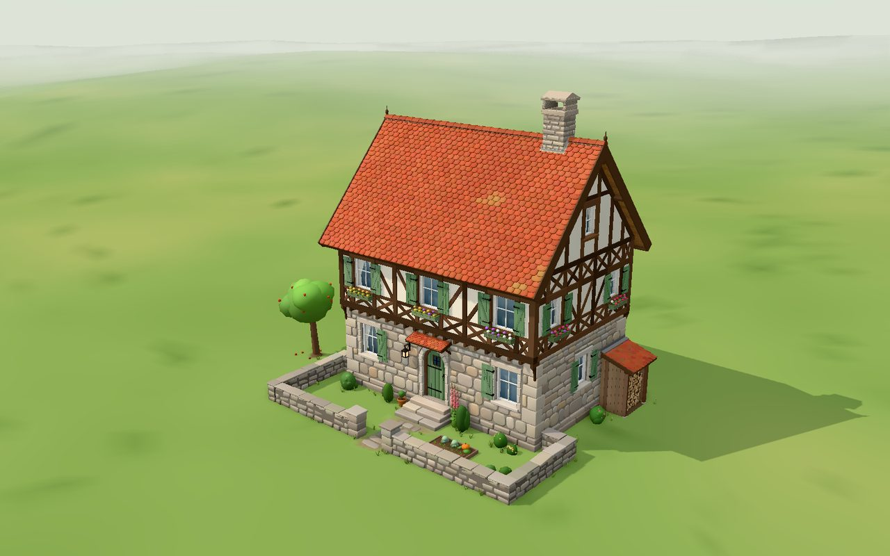
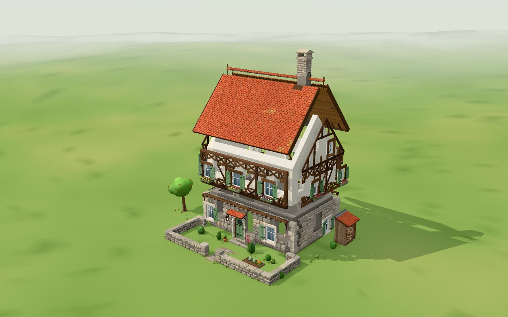
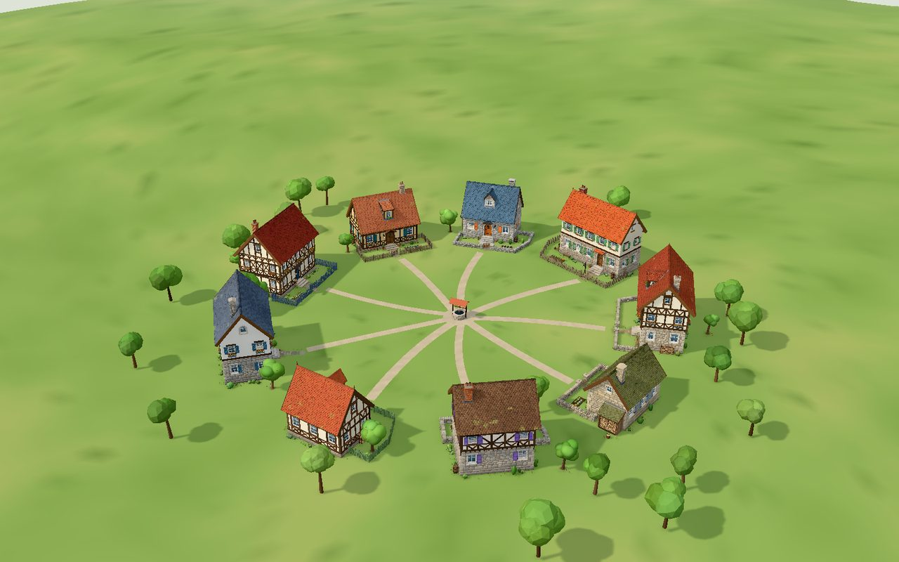
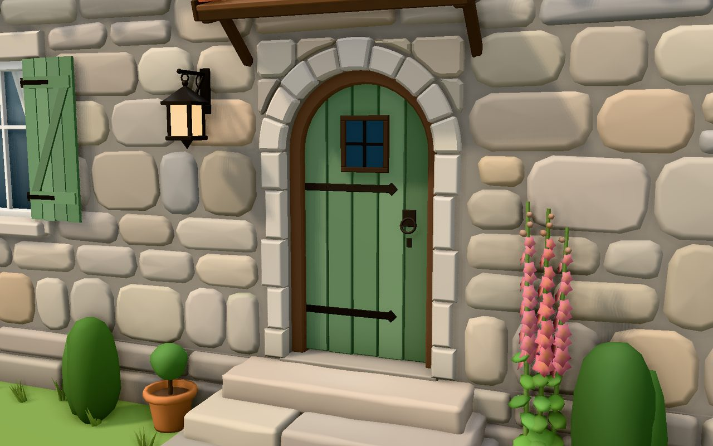
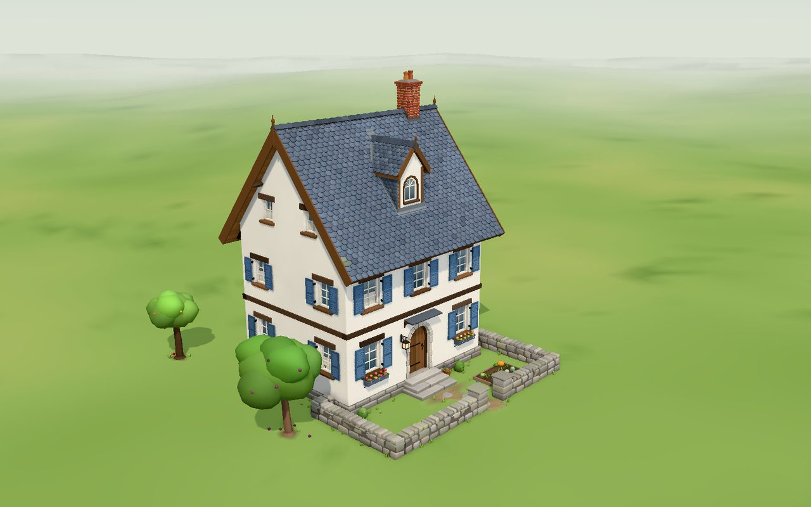
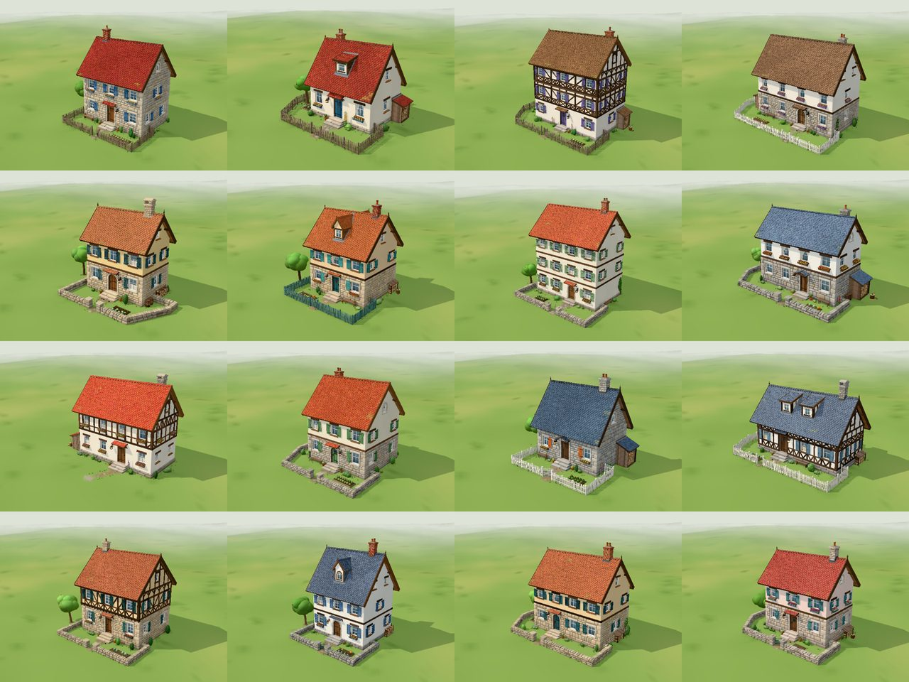

# Hearthwright — procedural village houses

A first step towards a Tiny-Glade-like tool that **generates** charming
structures instead of having them modelled by hand. This prototype generates
one thing well: a village house, from a seed and a handful of parameters.

Every house is built from code: no hand-modelled meshes or textures. Each stone, tile, plank,
beam, shutter and flower is placed by a generator and painted with vertex
colours, so the output exports cleanly to glTF (`.glb`) for Blender, Godot,
Unity or the web.



| Exploded into its generated layers | A village of nine seeds |
|---|---|
|  |  |
|  |  |



## Run it

```bash
npm install
npm run dev          # interactive viewer at http://localhost:5173
```

In the viewer: **New house** rolls a new seed; the panel changes footprint,
storeys, wall styles (stone / plaster / timber per floor), jetty, roof pitch
and overhangs, dormers, roof covering, chimney, shutters, flower boxes,
palette and garden props. The **Exploded view** slider (and **Play
assembly**) pulls the generated layers apart, so you can see how the house is
put together; **Layers** hides parts; **Village of nine** places nine
generated houses around a green with a well, lanes and trees;
**Download .glb** exports the current house (or village).

## How it works

```
HouseParams ──computeLayout──▶ HouseLayout ──8 parts──▶ geometry ──▶ viewer / .glb
  (what you ask for)            (the plan)     (what it looks like)
```

1. **Params** (`src/gen/params.ts`): size, storeys, styles, roof, details, palette.
   `randomParams(seed)` produces a coherent random house.
2. **Layout** (`src/gen/layout.ts`): pure numbers, and the architectural
   decisions. Storeys and their walls (with a knee wall when the eave would
   otherwise hang over the windows), window columns and door placement,
   every opening with its lintel/sill/surround zone, jetty joist zones, the
   door-hood zone, roof geometry, covering, holes and dormers, chimney, door
   steps, level of detail. All parts read this and only this, so they always
   agree on where things are.
3. **Parts** (`src/gen/parts/*.ts`), each an independent generator:

   | Part | Generates |
   |---|---|
   | `foundation` | stone plinth course wrapping the corners, door steps |
   | `walls` | wall bodies with openings cut out, gable triangles |
   | `stonework` | hand-laid field stone in irregular courses, interlocking quoins |
   | `timber` | half-timber framing (posts, rails, braces, gable framing), storey bands, jetty joists and brackets |
   | `openings` | windows, doors, lintels/arches, sills, shutters, flower boxes, door hood |
   | `roof` | deck and soffit, beaver-tail / fish-scale / slate / shingle courses, lichen, ridge, barge boards, fascia, finials; leaves holes for chimney and dormers |
   | `dormers` | gabled and shed dormers: face, cheeks, window, little tiled roof, lead valleys and flashing |
   | `chimney` | brick or stone stack, cap and pots, lead flashing laid over the actual tile courses |
   | `props` | path, wall lantern, pots, woodpile or lean-to woodshed, bench, barrels, planting, climbers, grass |

4. **Builder** (`src/gen/builder.ts`): pieces are merged into one mesh per
   material per wall/slope, so a house is a few dozen draw calls.

Same seed → same house: each part draws from its own forked random stream.

`docs/ARCHITECTURE.md` has the coordinate conventions, the ownership and
depth contracts between parts, and the art direction.

## Tools

```bash
npm run typecheck
node scripts/shoot.mjs --out shots iso="seed=7&cam=iso" door="seed=7&cam=door"   # headless renders
node scripts/shoot.mjs --glb --out shots house="seed=7"                          # + .glb export
node scripts/sweep.mjs --count 300 --set p.floors=3                              # robustness sweep
node scripts/build-artifact.mjs --out dist/hearthwright.html                     # single-file viewer
```

## Where this goes next

The layout layer is the hook for a bigger generator: a village or castle
tool would place footprints, pick params per building, and later extend the
layout vocabulary (L-shaped plans, dormers, hip roofs, towers, walls drawn
along curves), while the part generators keep supplying the hand-made detail.
